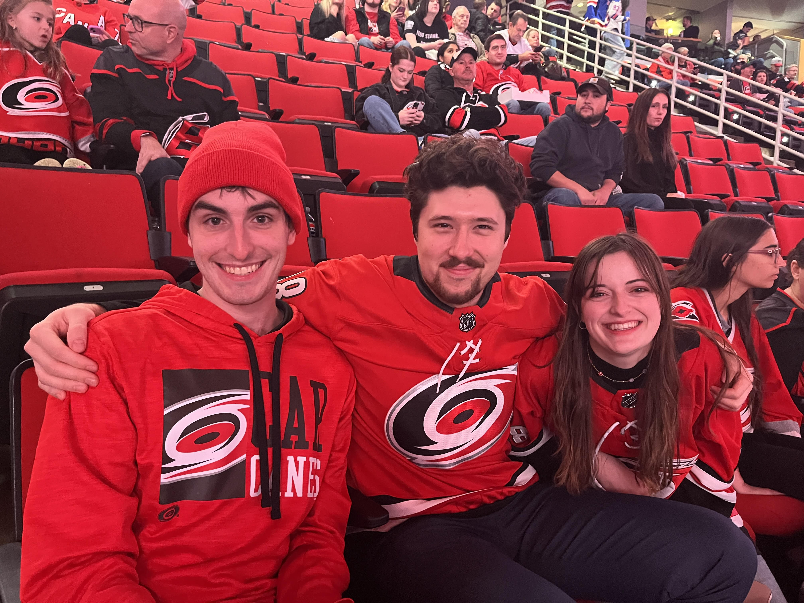

My name is Kenaniah Dodson. I am from Raleigh, NC, though I have lived all over North Carolina (go heels!). I am an experienced project manager with a focus on data analytics, data visualization, and leading high-performing teams.

Every day, I transform data into actionable insights that drive strategic decisions across multiple levels of management. Whether it's building dashboards, analyzing trends, or solving complex problems, I thrive at the intersection of data and decision-making.

I'm passionate about uncovering the “why” behind the numbers. There's power in understanding our customers — and I believe that meaningful improvements start with meaningful insights.

I also enjoy...

- Running
- Football (go Birds!)
- Coffee (who doesn't?)
- Every genre of music except country (sorry!)
- Hockey (go Canes!)

*Find my contact info on my "experience" page, or click one of the contact options at the bottom of the page.*

